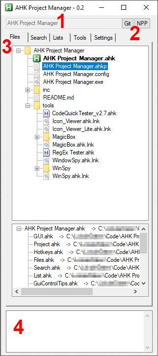
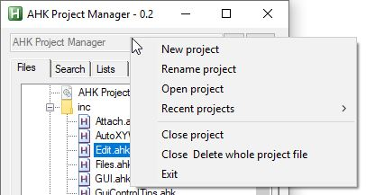
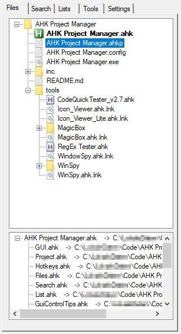
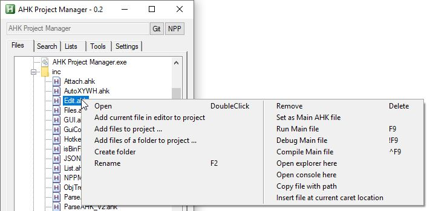
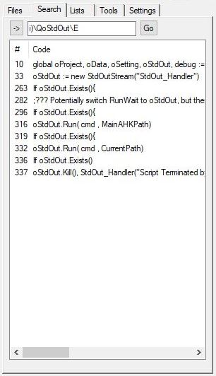
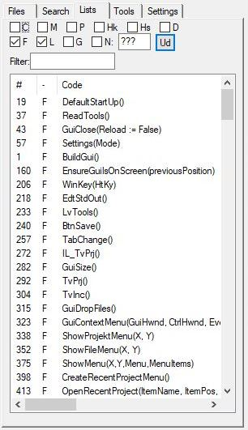
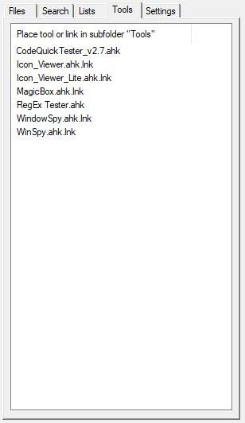
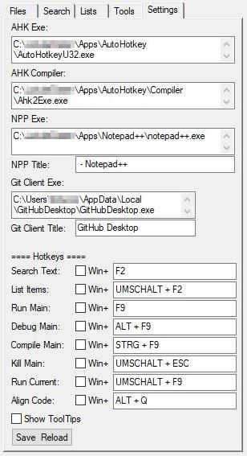
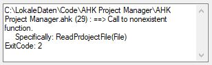

# AHK Project Manager

A tool that helps to manage, code and test projects with several AHK files by offering shortcuts and automation for repetitive tasks.

## Concept

* This tool is designed to be to the left or right of the editor similar to a sidebar. It can be freely positioned and resized. It doesn't dock to the editor.
* The manager does show and manage only one project at a time, but keeps track of recent project and the projects can be switched easily.
* For each project a tree can be created to list files and group them into folders. This can represent the files on the disk, but it could be any structure to the liking of the user. Double click opens the file in the editor or in case of a binary file with the default application.
* Only one file can be set as main file. This file will be used to run, compile or debug the project.

## GUI

The GUI 
1. shows the name of the project.
1. offers two buttons to open a git client or Notepad++
1. has a tab control to provide different functions
1. gives feedback in the lower edit control

### Projects 

Projects are purely handled via context menu.
All information regarding a project is stored within a AHK project file (.ahkp)
Upon creation of a new project the user is asked to specify a location and name of this file.

### Files

The Files Tab has two tree view controls.

In the upper tree the user can add files and folders to his liking.
All actions are available through context menu. For a few actions keyboard shortcuts are available.

When a master AHK file is specified within the project the lower tree gets populated recursively with the hierarchy of included files of the master file.

### Search

When a keyboard shortcut gets pressed (default: F2) within the editor any selected text gets searched within the main AHK file and all its included files. The results are shown in a list with line number, the text on that line, the filename and the path of the file.

Double click on an item opens the file in the editor and places the caret in that line.

Any regular expression can be used to customize the search.

### Lists

The Lists Tab lists a selection of AHK items within the main AHK file and all its included files.
* C: Classes
* M: (Class) Methods
* P: (Class) Properties
* Hk: HotKeys
* Hs: HotStrings
* D: DllCalls
* F: Functions
* L: Labels
* G: Global Variables
* N: Notes that start with e.g. ???

The list can be filtered. Also from within the editor by pressing a keyboard shortcut (default: Shift+F2).

### Tools

When tools (exe or ahk files) are placed as links or directly within the subfolder `<Tools>` of this script they are available on this tab by double click.

### Settings

Most settings for customization can be set on this tab.

Notice: 
* Hotkeys are disabled when on this tab
* Changed settings only have an effect when the "Save & Reload" button is pressed
* Currently only Notepad++ is supported as editor, since an interface has to exist for interaction
* Debug requires the DBGp plugin for Notepad++
* "Run current" runs the file in the current active view of Notepad++ (ignoring the main AHK file of the current project)
* "Align Code" is a different approach to align selected text within the editor

### Feedback

When the main file is run, compiled or debugged, the standard output of AutoHotkey is shown in this edit control.
When an error message is shown the file gets opened in the editor and the caret is placed on the mentioned line. 